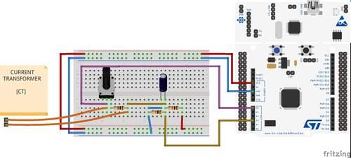

## Project for CYBER PHYSICAL SYSTEMS course

Welcome to Energy Meter application. I build an energy meter app based on the
Nucleo-F401 and Riot-OS.

[Release documentation](./media/ITA_final_documentation.pdf)

### Instructions
1. Setup your system. I'm using fedora so the command that you find are based
   on my distro.
   ```
   $ sudo dnf update
   $ sudo dnf install arm-none-eabi-binutils-cs arm-none-eabi-newlib arm-none-eabi-gcc-cs arm-none-eabi-gcc-cs-c++
   $ sudo dnf install git-core make stlink make patch vim
   ```

2. Checkout of the code:
   ```
   $ mkdir app
   $ cd app
   $ git clone https://github.com/RIOT-OS/RIOT.git
   $ git clone https://github.com/Ciusss89/_riot-os_app.git
   ```

   The app directory should be contain two `RIOT` and  `_riot-os_app` directory,
   setup the code:

   ```
   cd RIOT/
   git checkout <LATEST_RELEASE>
   cd ../_riot-os_app
   git checkout <LATEST_RELEASE>
   ```

### Energy Meter App: Compile the app

1.  Compile and write the application on the nucleo board:
    ```
    make clean all flash
    ```
2.  The Nucleo board has debug chip on-board. It connectes its virtual COM
    `/dev/ttyACM0` to the SUART2 of the mcu. Open new terminal and start uart
    communication:
    ```
    sudo picocom -b 115200 /dev/ttyACM0 --imap lfcrlf
    ```
3.  Run `help` to see a list of all available commands
    ```
    > help
    help
    Command              Description
    ---------------------------------------
    em                   em - energy meter application
    reboot               Reboot the node
    ps                   Prints information about running threads.
    ```
### Project Overview

1. Hardware: The STM32F401RE microcontroller is hosted on the Nucleo board.
2. Current meter probe: I built a cheap current transformer (CT) probe and
   I used the MCU to collect the data.
3. I wrote an app called (energy meter) that samples the corresponding  AC
   voltage of CT and collects data.




### Nucleo64 F401 Overview

The Nucleo-F401 is a board from ST's Nucleo family supporting a ARM Cortex-M4
STM32F401RE microcontroller with 96Kb of SRAM and 512Kb of ROM Flash.


### MCU

| MCU        | STM32F401RE       |
|:------------- |:--------------------- |
| Family | ARM Cortex-M4     |
| Vendor | ST Microelectronics   |
| RAM        | 96Kb |
| Flash      | 512Kb             |
| Frequency  | up to 84MHz |
| FPU        | yes               |
| Timers | 11 (2x watchdog, 1 SysTick, 6x 16-bit, 2x 32-bit [TIM2])  |
| ADCs       | 1x 12-bit         |
| UARTs      | 3                 |
| SPIs       | 4                 |
| I2Cs       | 3                 |
| RTC        | 1                 |
| Vcc        | 2.0V - 3.6V           |
| Datasheet  | [Datasheet](http://www.st.com/resource/en/datasheet/stm32f401re.pdf) |
| Reference Manual | [Reference Manual](http://www.st.com/web/en/resource/technical/document/reference_manual/DM00031936.pdf) |
| Programming Manual | [Programming Manual](http://www.st.com/resource/en/programming_manual/dm00046982.pdf) |
| Board Manual   | [Board Manual](http://www.st.com/resource/en/user_manual/dm00105823.pdf)|
