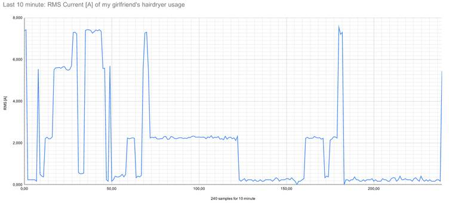
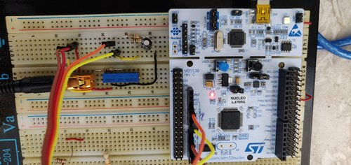

## Energy Meter APP

Welcome to Energy Meter application. This project implements an APP which
measures the AC Energy Consumption. The system uses a Nucleo64 board which
runs RIOT-OS and a current transformer as probe.



The picture shows one of 3 data buffer which contain last samples of current

### Requirements
1. This project runs with [RIOT](https://riot-os.org/):

> RIOT powers the Internet of Things like Linux powers the Internet. RIOT is a
> free, open source operating system developed by a grassroots community
> gathering companies, academia, and hobbyists, distributed all around the world.
>
> RIOT supports most low-power IoT devices and microcontroller architectures
> (32-bit, 16-bit, 8-bit). RIOT aims to implement all relevant open standards
> supporting an Internet of Things that is connected, secure, durable &
> privacy-friendly.

2. RIOT has a lot of [tutorials](https://github.com/RIOT-OS/Tutorials) and
   [course](https://github.com/RIOT-OS/riot-course). There is not need any
   board because you can use a virtual machine.

3. Energy meter application can runs on each application supported by riot.

### Instructions
1. Setup your system. I'm using fedora so the command that you find are based
   on my distro.
   ```
   $ sudo dnf update
   $ sudo dnf install arm-none-eabi-binutils-cs arm-none-eabi-newlib arm-none-eabi-gcc-cs arm-none-eabi-gcc-cs-c++
   $ sudo dnf install git-core make stlink make patch vim
   ```

2. Checkout of the source code:
   ```
   $ mkdir app
   $ cd app
   $ git clone https://github.com/RIOT-OS/RIOT.git
   $ git clone https://github.com/Ciusss89/_riot-os_app.git
   ```

   The app directory should be contain two `RIOT` and  `_riot-os_app` directory,
   setup the code:

   ```
   cd RIOT/
   git checkout <LATEST_RELEASE>
   cd ../_riot-os_app
   git checkout <LATEST_RELEASE>
   ```

   Where `LATEST_RELEASE` is last stable tag

### Compile the app and Run

1.  Compile and write the application on the nucleo board:
    ```
    make clean all flash
    ```
2.  The Nucleo board has debug chip on-board. It connectes its virtual COM
    `/dev/ttyACM0` to the SUART2 of the mcu.
    Connect to Nucleo64 board can run the command `make term`
    communication:
    ```
    make term
    ```

    Otherwise you can also use putty or picocom:

    ```
    sudo picocom -b 115200 /dev/ttyACM0 --imap lfcrlf
    ```

### Project Overview

1. Hardware:
> I tested the project with a STM Nucleo64 board and it works obviously with
> others boards supported by Riot.
> Regarding the current probe I used a cheap current transformer (CT) which
> converts the induced current into a tension using burden resistor as
> transconductance amplifier.

2. Option setup:
> All relevant parameter are configurable by Makefile throught CFLAGS. The supported
> CT are: YHDC TA1020, YHDC SCT013-000.

2. Algorithms:
> The ADC samples a signal plus the DC bias. It collects continuously 12 samples
> for each 20ms and remove the DC bias offset. The data is filtered through
> moving average algorithm.
> There are four thread, the first take care of ADC conversion, the others
> store the realtime measure into two array (current, voltage). Each array
> collects 240 samples of last 60 seconds, last 10minutes, last 60minutes.
> Each array has been implemented as circular buffer.

3. Implementation:

   
   

### Examples:
Set debug mode 3 which prints the contents of buffer array, then you have
to export the printed values into csv file.

Check the directory tests where there are saved measure.

You can take a look at this [Google sheet](https://docs.google.com/spreadsheets/d/1U7BSr7nPFPo_V7PK5NfKe2i75gcsldSk4o3UBebkcwg/edit#gid=716511268) which reports data and graphics

Eample of usage:
```
> reboot
�ain(): This is RIOT! (Version: 2021.04-devel-931-gbf93d)
RIOT on a nucleo-l476rg board, MCU stm32
[###] DEBUG LEVEL=3
Starting EnergMeter service...
[*] CT sensor setup:
	 RMS MAX current: 15A
	 Max primary peak current: 21.213203A
	 Max secondary peak current: 0.010607A
	 Burden resistor: 141.421356Ω
[*] ADC setup:
	 ADC bits: 8
	 ADC bias offset: 128
	 ADC scale factor: 0.011765
	 ADC sampling frequency: 600HZ
	 ADC gets [12] sample each 1666 usec
[*] ADC Calibration: Target=[128], Mesured=[126], Bias=[1.62422V]
[*] Energy Measuring: sampling has started
[*] Energy Measuring: collect_1m has started
[*] Energy Measuring: collect_10m has started
[*] Energy Measuring: collect_60m has started
> help
Command              Description
---------------------------------------
em                   em - energy meter application
reboot               Reboot the node
version              Prints current RIOT_VERSION
pm                   interact with layered PM subsystem
ps                   Prints information about running threads.
> em
Last 60s samples:
 id;Current;Voltage
  0; 0.24; 230.00
  1; 0.24; 230.00
  2; 0.29; 230.00
.
..
...
237; 0.73; 230.00
239; 0.53; 230.00
Last 10m samples:
 id;Current;Voltage
  0; 0.73; 230.00
  1; 0.53; 230.00
  2; 0.47; 230.00
.
..
...
238; 0.53; 230.00
239; 0.53; 230.00
Last 60m samples:
 id;Current;Voltage
  0; 0.73; 230.00
  1; 0.53; 230.00
  2; 0.47; 230.00
.
..
...
236; 0.53; 230.00
237; 0.55; 230.00
238; 2.33; 230.00
239; 2.53; 230.00
Current 0.407541A
Voltage 230V
last 60 seconds current average 0.39A
last 60 seconds voltage average 230.00V
last 10 minutes current average 0.41A
last 10 minute voltage average 230.00V
last 60 minutes current average 0.50A
last 60 minutes voltage average 230.00V
```

The final doc release is available here (only ita) [Release documentation](./media/ITA_final_documentation.pdf)

Note: Documentation was written for tag v1.0. Documentation has been developed for the
project of CYBER PHYSICAL SYSTEMS.
